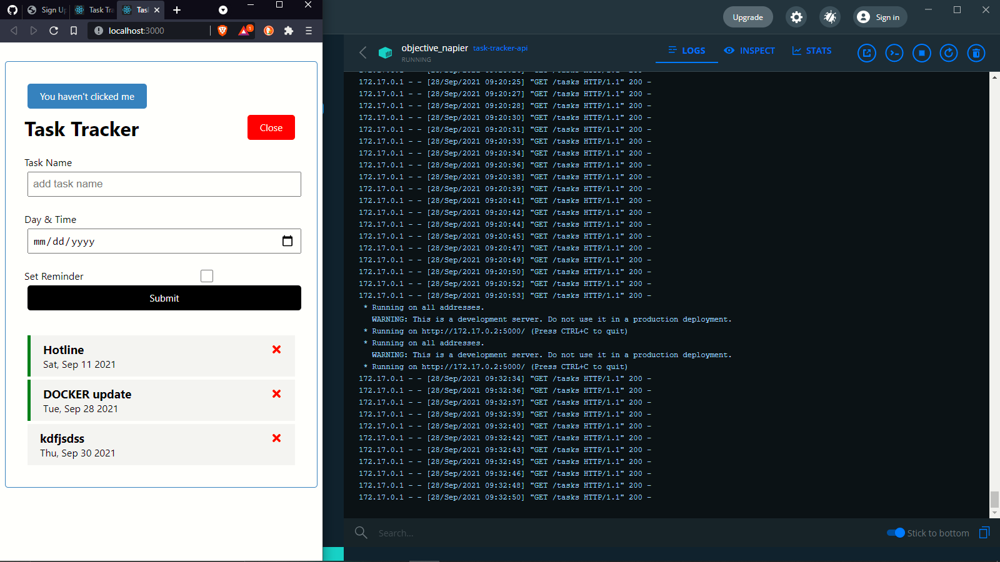
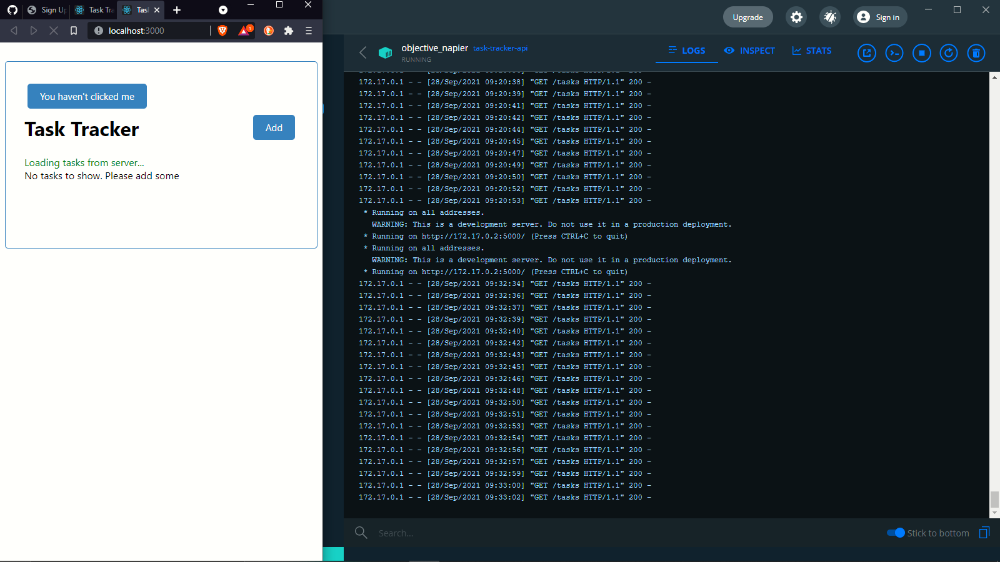

# Task Tracker React App

-the application frontend it created using React and backend using flask
-When it was developing it the backend was running in a Docker container.
-the backend can be found in my github page named [**task-tracker-api**](https://github.com/mosesborore/flask-api-in-docker)

## What it can do

-Create, delete, and update tasks(change reminder to true. Which is indicated by a green border on the left)
-has a form to create the tasks. You can hide and show the form
-Below the Form, is the list of tasks

## preview screenshot

